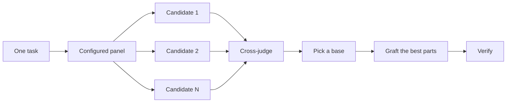

# Design before you write code

> Originally by [poteto](https://github.com/poteto) for [Cursor pstack](https://github.com/cursor/plugins/tree/main/pstack). Adapted for Hermes Agent.

One attempt at a hard design locks in the first shape the model thought of. `pstack:architect` settles types and boundaries before implementation. `pstack:interrogate` has other models try to break the result. When the job is coverage rather than design synthesis, `pstack:swarm` fans out slices or races and aggregates their results.

## Settle the shape with `pstack:architect`

```text
load pstack:architect design the import pipeline before writing any code. i care most about how callers use it.
```

[`pstack:architect`](../../skills/architect/SKILL.md) grounds itself first, running `pstack:how` over the code the design touches and `pstack:why` when it moves ownership or layers. Then it runs a competitive design round to produce competing design sketches, with the caller's usage written first in each, followed by types, signatures, and a module map.

By default it proceeds straight from the synthesized design into implementation. If you want to see the design first, say so:

```text
load pstack:architect with checkpoint. stop and show me before implementing.
```

## Fan out attempts with competitive design rounds

For problems where independent attempts would help (naming, formats, algorithms), you can ask the agent to run multiple delegate_task workers on the same brief in parallel. Each writes to its own directory. A read-only judge, on a different model family when your configuration allows one, scores every candidate against a rubric. The coordinator reads each candidate end to end, picks a base, grafts in the best ideas from the losers, and verifies the result.



The panel comes from your [`pstack:setup-pstack`](../../skills/setup-pstack/SKILL.md) configuration, and you can adjust it per task.

## Cover slices and races with `pstack:swarm`

```text
load pstack:swarm check every package under packages/ against its check.sh. one worker per package. one report.
```

[`pstack:swarm`](../../skills/swarm/SKILL.md) fans N workers across independent slices, coverage matrices, gauntlet lanes, exploration partitions, or declared race arms. Each worker gets its own scope and check, then reports `PASS`, `ISSUES`, or `BLOCKED`. The parent waits for the workers and returns one compact report with any gaps or dropouts.

Reach for it when parallelism buys coverage or lets independent checks race. Competitive design rounds give every worker the same brief, then pick a base and graft the best parts. `pstack:swarm` covers slices or runs a race with a selection rule declared up front. It does not use the base-selection and grafting ceremony.

## Break it with `pstack:interrogate`

```text
load pstack:interrogate the whole branch, but skeptically. no nitpicks unless it's an actual bug or regression.
```

[`pstack:interrogate`](../../skills/interrogate/SKILL.md) sends the same diff, intent, and rubric to several reviewers on different model families. Model diversity is the point. Different models have different blind spots, so a finding two models raise independently is high-confidence signal. The lead sorts everything into `Act on`, `Consider`, `Noted`, and `Dismissed`, with a reason for each dismissal, and applies nothing automatically.

Read the dismissals too. The lead is a pragmatic senior engineer, not an oracle, and you can override it.

## How much design work does a task deserve?

You might be wondering whether every change needs this. No. Most changes need none of it. A rough ladder:

- A small, finished change you're unsure about needs `pstack:interrogate` alone.
- A change that crosses function boundaries or moves ownership earns `pstack:architect`, which brings competitive design rounds with it.
- A standalone decision where independent attempts would help, like naming, formats, or an algorithm, can use competitive design rounds directly via delegate_task.
- A coverage matrix, set of parallel checks, or race with declared arms is `pstack:swarm`.
- A contested design that's expensive to reverse gets `pstack:architect`, then `pstack:interrogate` before shipping.

`pstack:poteto-mode` already applies this ladder. Boundary-crossing work triggers `pstack:architect` on its own, so you reach for these directly mainly when you want more or less scrutiny than the default.

Next: [Build and clean the change](./05-build-and-clean.md).
